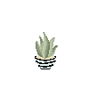
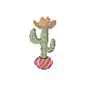
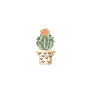

## Claire Spain
### Final

### Summary
  A lonely desert town struggles with a sudden drought, they ask you to save them. Whilst investigating, you find yourself against a crabby ol' desert witch. Who, conviently announces, that she's the reason for the sudden drought. Upon inquiry for her actions, the witch reciprocates.

  "One evening I was out collecting good ol' shrubbery for me here hut, when these cactuses --"

  "Cacti" you correct.

  The witch slowly blinks at you "-THE PRICKLY DEMONS POKED ME IN THE BUM."

  "They sure would poke you."

  "So I cursed these lands for a hundred year drought to kill all these cactuses."

  "--cacti"

  "I know what I said and I won't say it again!"

  "It's cacti though..." you reply. "Also wouldn't a drought kill everything else here and aren't cacti built to withstand droughts?"

  "Do you wanna play the game or not?" squealed the witch.

  "I suppose I am the hero afterall."

  **Shoot the cacti and earn points**

[Cacti Shooting](https://clarissaspain.github.io/120-work/Final/)

    
