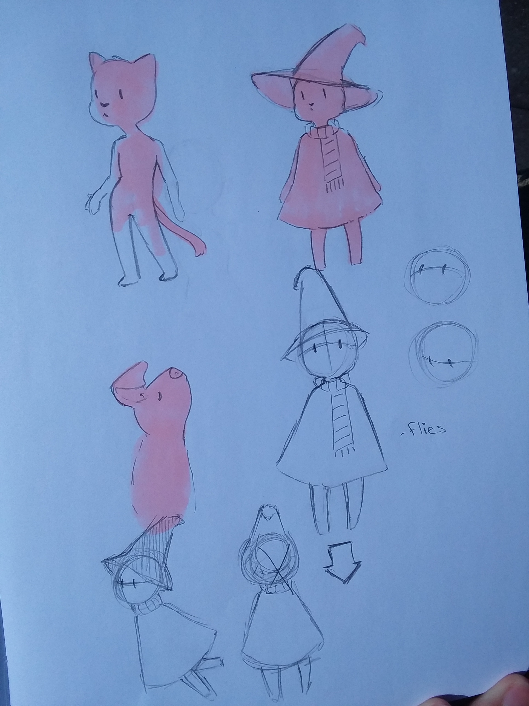

# 120-work Final
## Claire Spain Group C

My proposal for the Final is to create a small in-web game. I want to ellaborate on the work I did in week 12, but I scrapped tat design and started with some conceptual drawings.

(I lost my stylus for drawing the other day and I won't have it until next week and so the artistic design for the Final will have to wait until the following week.)

I want to create a sprite-type model as the main character in the game. It will still be an aim and shoot game, but I want to have more dimension than my work that I did in week 12. I was told that I have the interaction started, but focus on enemy deletion, player deletion, and maybe "hordes".

This week I'm focusing on creating a local server, so that I can set up images in my sketch.

A work plan, with internal deadlines for yourself and a description about how you intent to complete the final project on time. (Note: there will be no extensions offered for the final project).
A discussion of any work you have completed this week towards your final project.

### Deadlines

1. Create base interaction, similar to week 12.
2. Sketch some designs and study sprite models.
3. Draw sprites and other objects for game.
4. Put together .js sketches, upload online.

### Concept art

