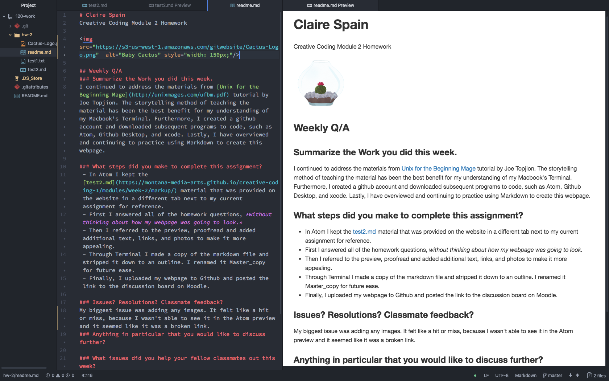

# Claire Spain
*Creative Coding Module 2 Homework*


## Weekly Q/A
### Summarize the Work you did this week.
I continued to address the materials from [Unix for the Beginning Mage](http://unixmages.com/ufbm.pdf) tutorial by Joe Topjion. The storytelling method of teaching the material has been the best benefit for my understanding of my Macbook's Terminal. Furthermore, I created a github account and downloaded subsequent programs to code, such as Atom, Github Desktop, and xcode. Lastly, I have overviewed and continuing to practice using Markdown to create this web page.

Downloaded packages to make Atom easier to use:
- highlight-selected
- fonts
- file-icons
- language-markdown
- todo-show
- linter
 - html linter
 - css linter
- open-recent
- pigments

### What steps did you make to complete this assignment?
 1. In Atom I kept the provided [test2.md](https://montana-media-arts.github.io/creative-coding-1/modules/week-2/markup/) material from the website in a different tab next to my current assignment for reference.
 2. First I answered all of the homework questions, *without thinking about how my webpage was going to look.*
 3. Then I referred to the preview, proofread and added additional text, links, and photos to make it more appealing.
 4. Through Terminal I made a copy of the markdown file and stripped it down to an outline. I renamed it Master_copy for future use.
 5. Finally, I uploaded my webpage to Github and posted the link to the discussion board on Moodle.

### Issues? Resolutions? Classmate feedback?
My biggest issue was adding any images. It felt like a hit or miss, because I wasn't able to see it in the Atom preview and it seemed like it was a broken link. After some further research I uploaded my picture onto [amazonaws](https://aws.amazon.com/console/), there the website stores the image and creates an URL. I make the image public, and with the URL I can then copy and paste into my markdown file and people are able to view it from anywhere. My next issue was sizing and that's where the html that I have provided below comes in.
```html

```
But then I realized it didn't affect how it looked on the web simply in the preview. So I went back to my photo and compressed the 1000x1000 px photo to 150x150 px and uploaded it again to the Amazon S3 service. I genuinely felt like there was an easier way to do this so I went ahead and posted a forum to Mart 120 discussions.
- I got responses from ReadReedRed, cloninger-carrie, and MarkLannenUM and essentially, I needed to put the name of the image from my Github repository and put it in my file. So even though I got the same results, I took a more difficult path; however, I genuinely feel like I learned something and was able to put an issue out for my class to answer.

### Anything in particular that you would like to discuss further?
I did buy the recommended HTML and CSS book from the course materials and it helped quite a bit with this markdown file. It's definitely something to look into if anyone is still deciding whether or not to buy the book.
### What issues did you help your fellow classmates out this week?
Keeping my eyes peeled for any new issues that will come up.
## Screenshot of Markdown file in Atom


*I had a lot of fun throwing in a quick illustration of a cactus named Caspian.*
