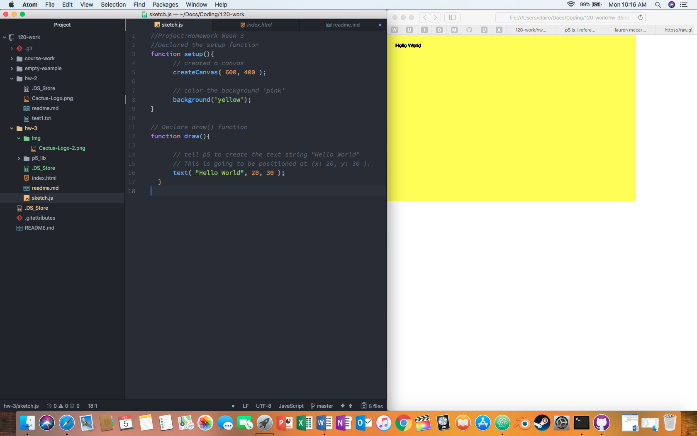

# Claire Spain
*Creative Coding Module 3*

["Hello World!" Sketch]


## Week 3 Q/A
### A Summary of the Work I did this Week
I created p5 canvases and pushed them to become live urls. Learned some basic functions of p5
  - function setup()
  - function draw()
  - background()
  - [More Functions from p5 Website](https://p5js.org/reference/)

Was also informed on the importance of Comments and their uses.
### My Steps
1. Copied empty-example and renamed hw-3 in Atom editor.
2. Edited sketch.js. Added the following:

```html
      createCanvas( 600, 400 );

      background('yellow');
}

function draw(){
      text( "Hello World", 20, 30 );
      textsize(16);
  }
```
3. Commited and pushed file to my online repository.
4. Made my Github 120 repository a live url and added hw-3/ to the end of the url, then I copied the url and added it as a link at the top of this webpage.

### Issues? Resolutions? Classmate feedback?
I add a quick mistep in trying to do the Inspect Element in my browser. I quickly realized that I needed to actually change my preferences. Preferences> Advanced > *down at the bottom, toggle* Show Develop menu in menu bar. The Inspect Element will be pretty handy in looking at other webpages and how they created their sites.

### Further Discussion
The font/size of my original Hello World sketch looked a little off and so I changed the size of the text in my sketch and it made the text much cleaner.

### Screenshot of my sketch.js and html code

