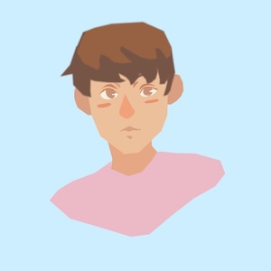
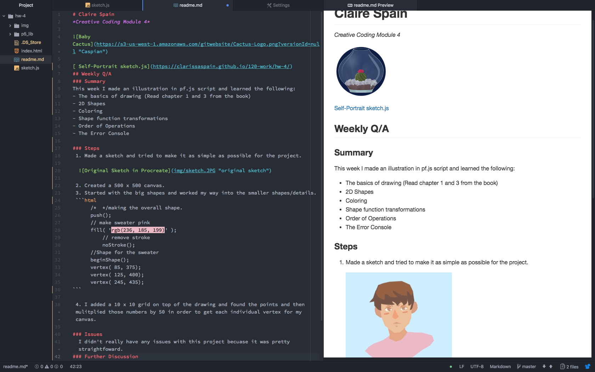
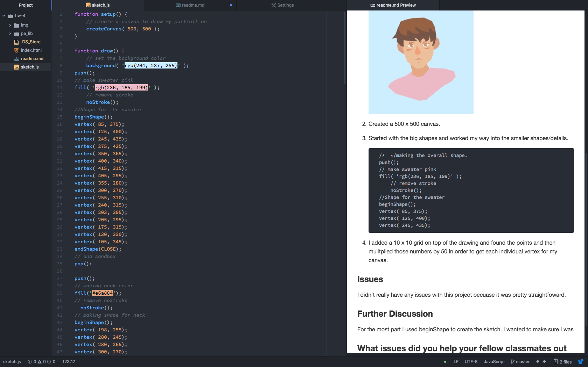

# Claire Spain
*Creative Coding Module 4*


[ Self-Portrait sketch.js](https://clarissaspain.github.io/120-work/hw-4/)
## Weekly Q/A
### Summary
This week I made an illustration in p5.js script and learned the following:
- The basics of drawing
  - *Read chapter 1 and 3 from the book.*
- 2D Shapes
  - ```triangle(230, 249, 235, 253, 243, 249);```
- Coloring
 - ```fill('#cc8269')```
- Function transformations
 - ``` translate(-2, 5)```
- Order of Operations
  - *Super important when it came to adding the hair and the face details.* 

### Steps
 1. Made a sketch and tried to make it as simple as possible for the project.

  

 2. Created a 500 x 500 canvas.
 3. Started with the big shapes and worked my way into the smaller shapes/details.
 ```html
      /*  */making the overall shape.
      push();
      // make sweater pink
      fill( 'rgb(236, 185, 199)' );
          // remove stroke
          noStroke();
      //Shape for the sweater
      beginShape();
      vertex( 85, 375);
      vertex( 125, 400);
      vertex( 245, 435);
```

 4. I added a 10 x 10 grid on top of the drawing and found the points and then mulitplied those numbers by 50 in order to get each individual vertex for my canvas.

### Issues
I didn't really have any issues with this project becuase it was pretty straightfoward. For a second I add issues using
### Further Discussion
For the most part I used beginShape to create the sketch. However, I made sure to use other forms of drawing; inlcuding, *quads, triangles,* and *lines*. The other shapes didn't quite match the style of my sketch.

## Screenshots
Readme File


Sketch.js File

