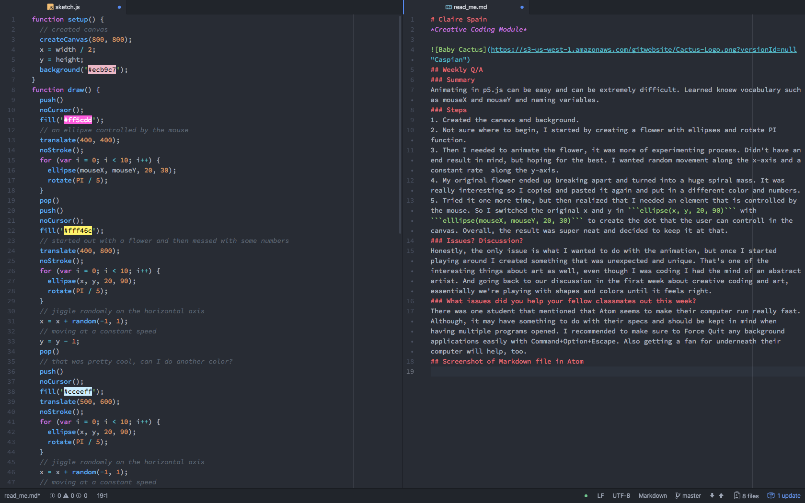

# Claire Spain
*Creative Coding Module*


## Weekly Q/A
### Summary
Animating in p5.js can be easy and can be extremely difficult. Learned new vocabulary such as mouseX and mouseY and naming variables.
### Steps
1. Created the canavs and background.
2. Not sure where to begin, I started by creating a flower with ellipses and rotate PI function.
3. Then I needed to animate the flower, it was more of experimenting process. Didn't have an end result in mind, but hoping for the best. I wanted random movement along the x-axis and a constant rate  along the y-axis.
4. My original flower ended up breaking apart and turned into a huge spiral mass. It was really interesting so I copied and pasted it again and put in a different color and numbers.
5. Tried it one more time, but then realized that I needed an element that is controlled by the mouse. So I switched the original x and y in ```ellipse(x, y, 20, 90)``` with ```elllipse(mouseX, mouseY, 20, 30)``` to create the dot that the user can controll in the canvas. Overall, the result was super neat and decided to keep it at that.
### Issues? Discussion?
Honestly, the only issue is what I wanted to do with the animation, but once I started playing around I created something that was unexpected and unique. That's one of the interesting things about art as well, even though I was coding I had the mind of an abstract artist. And going back to our discussion in the first week about creative coding and art, essentially we're playing with shapes and colors until it feels right.
#### Screenshots of index.html file


  
### What issues did you help your fellow classmates out this week?
There was one student that mentioned that Atom seems to make their computer run really fast. Although, it may have something to do with their specs and should be kept in mind when having multiple programs opened. I recommended to make sure to Force Quit any background applications easily with Command+Option+Escape. Also getting a fan for underneath their computer will help, too.
## Screenshot of Markdown file in Atom

