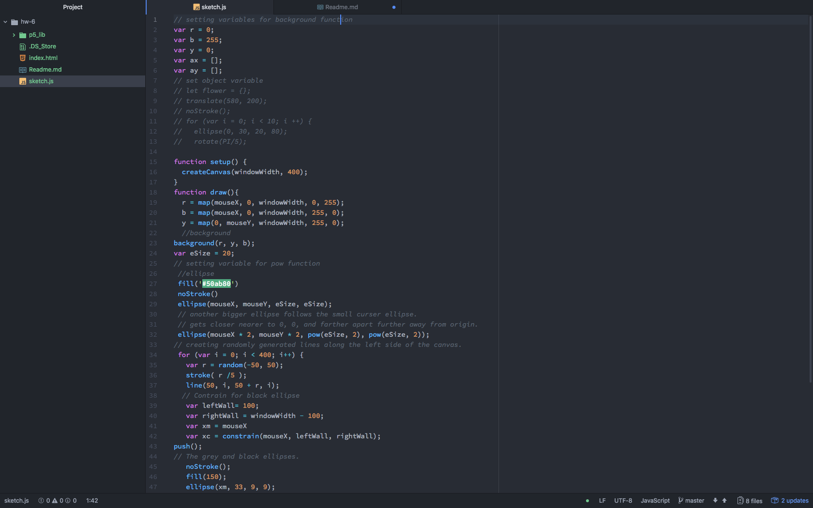

# Claire Spain
*Creative Coding Module Week 6*
## Weekly Q/A
### Summarry
   Math operations included the following:
   - addition
   - subtraction
   - division
   - modulo
   - multiplication
   - constrain
   - random
   - map
### Steps
1. I set up the canvas to be 600 by 400 at first and decided later to change it to windowWidth. Later on I figured out how to subtract or add  a number of pixels from windowWidth to create contrains.
2. Wrote a changing color background to mouseX to create some interesting variations.
3. Created randomly generated lines along the left side of the screen.
4. Added ellipses that would change their coordinates depending on the mouse. Also connected a line between the mouse and a constrained ellipse along the right side of the screen.
5. Wasn't super impressed with my work and tried to add a torus, which worked, but shifted everything to the right half off the screen. After deleting that, I was so tired and not able to add any new code to the sketch without the sketch breaking down or stalling.
6. Attempted one last time to create and object called Flower to replace one of the many ellipses and then called it a night.
### Further Discussion
This week was a little more confusing, I felt I was more just adding seperate code together into one canvas just to get all of the requirements. As a regular artist, it's like a piece of art that gets the job done but not necessarily proud of...? But it still took a lot of time, trying to go through everything to figure out what wasn't working and what was working.
## Screenshot of Markdown file in Atom

