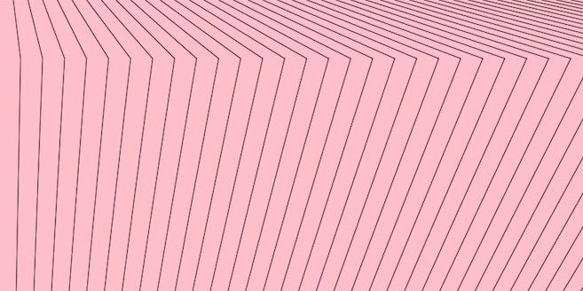
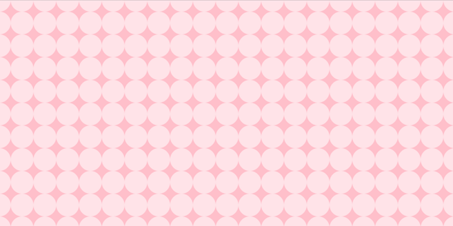

## Claire Spain
 Module 8 Group C

 [Live Sketch](https://clarissaspain.github.io/120-work/hw_8/)
### Loops
First, I practiced by writing some examples from __Make: Getting Started with p5.js__ pg 50 - 51.
4.9 Kinking lines

```
 for(var i = 20; i < 800; i += 20){
   line(i, 0, i + i/2, 80);
   line(i + i/2, 80, i*1.2, 400);
 }
 ```
4.10 Nested Loops

```
for (var y = 0; y <= height; y += 40){
  for(var x = 0; x <= width; x += 40){
    fill(255, 140);
    ellipse(x, y, 40, 40);
  }
}
```
### Summary of my work
The initial concept is pretty simple, the difficult part is deciding on how I would put my own spin on the assignment.
- 4.10 Nested loops example was pretty cute and I wanted to aim for the same aesthetic.
- I created this bezier shape that follows the mouse and it looks like a neat semi-transparent wing.

### Further Discussion
Referencing the p5.js website, I was intrigued with their libraries that provide extra information or expansion packs for the orginial p5.js library. For example, there's a library to interact code with sound, one for weather, another for speech, there's even one that makes primative shapes look like scribbles. I would like to look more into those features and how to impliment them into future projects.
